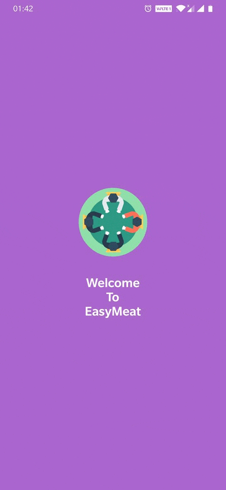
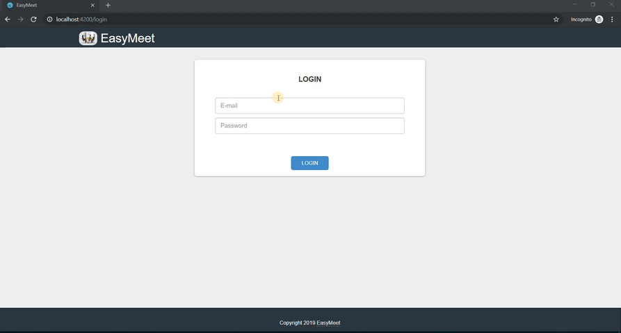
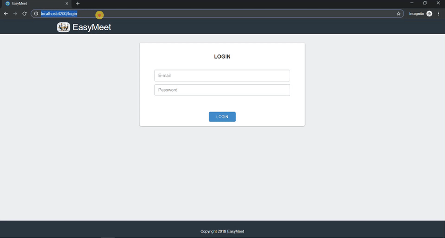

  <h1>Easy-Meet</h1>
  

* Mini Project For Semester 6 (2019)

## Functionalities
* Arrange Meetings, add people and notify them
* Record Meeting
* Get Transcripts of the meeting
* Speaker Diarization
* Meeting Summarization
* Task assigning

## Technology Stack
* Android
* Angular
* Firebase
* HTML, CSS, Bootstrap
* IBM Watson STT and NLU API

## Demo ##

   <b>Android App</b> 
  
   <b>Web</b> 
  
  

 

> [All Screenshots of the app](https://github.com/10aditya/easy-meet/tree/master/Screenshots)

## Contributors
* [Aditya Pingle](https://github.com/10aditya)
* [Ajinkya Pawar](https://github.com/Ajinkya0088)
* [Nikhil Patil](https://github.com/Nikhil4599)
